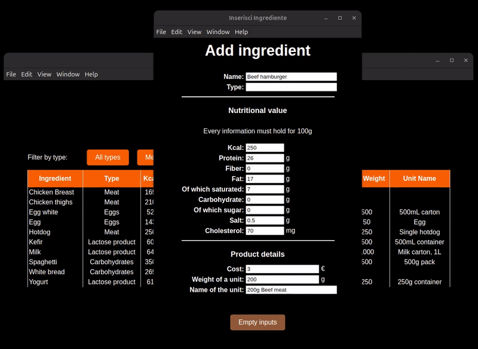

# DietManager

## What
DietManager is a tool designed to help users plan and modify their weekly diets with ease. 
It enables proactive meal planning for users aiming for body recomposition or other nutrition goals.

## Why I'm doing this
Most current diet tools only help users track food intake **in real-time**, focusing on calories and macronutrients **while** eating. 
However, for effective body recomposition, it's essential to **plan and adjust** your diet in advance. 
DietManager allows users to easily plan, modify, and optimize their diet over time, making it perfect for those looking to take control of their nutrition strategy.

## Features

### Ingredients
✅ Add/Modify Ingredient  
✅ Delete Ingredient  
✅ Ingredient List  

### Recipes
✅ Create/Modify Recipe  
✅ Delete Recipe  
✅ Recipe List  

### Daily Plan
- [ ] Create/Modify Daily Plan
- [ ] Delete Daily Plan
- [ ] Daily Plan List

### Weekly Plan
- [ ] Create/Modify Weekly Plan
- [ ] Delete Weekly Plan
- [ ] Weekly Plan List

### Future Features
- [ ] LLM Integration
- [ ] Nutrient & Calorie Tracking with Graphs
